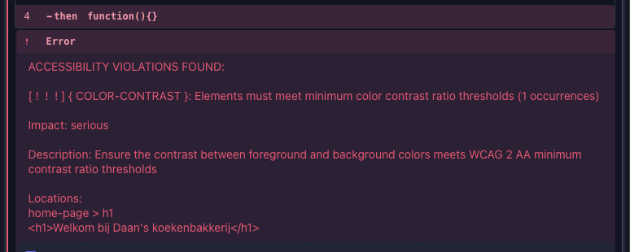

# Cypress Demo in Lit

Dit demo project dient ter ondersteuning van de poster over frontend testing met Cypress. Meer infomaratie over de poster en zijn inhoud vind je in de [bijbehorende poster bijlage op github gist](https://gist.github.com/daankent/664bdc079b8e3966844540120d0d74b6).

De volgende testmethoden worden in dit demo project gebruikt:

- [End-to-end testing](#end-to-end-testing)
- [Component testing](#component-testing)
- [Accessibility testing (met onderandere AXE)](#accessibility)

Daarnaast worden ook andere Cypress features gebruikt waar mogelijk wat uitleg bij nodig is:

- [Fixtures](#fixtures)
- [Network request stubbing](#network-request-stubbing)
- [Custom commands](#custom-commands)

## Demo draaien

Om de demo te draaien moet je een aantal stappen volgen:

1. Clone deze repository
2. Voer `npm install` uit om alle packages te installeren.
3. Om de json database op te starten voer je `npm run db` uit.
4. Om de demo applicatie te starten voer je `npm run dev` uit.
5. Om Cypress te starten voer je `npm run test` uit.
6. Nu kun je via Cypress tests draaien.

## End-to-end testing

Bij E2E testen controlleer je de werking van een volledige applicatie door het gedrag van een echte gebruiker te simuleren, vanaf de eerste tot de laatste actie. Je kan Cypress onderandere tussen pagina's laten navigeren, op knoppen laten drukken, laten typen, api requests laten opvangen/simulieren en nog veel meer. Hiermee valideer je dat alle componenten goed met elkaar samen werken. Je test dus niet alleen de frontend zelf, maar ook hoe deze samenwerkt met de backend en database en eventuele andere onderdelen. E2E testen geeft ten opzicht van de andere genoemde test opties met de grootste zekerheid aan dan een applicatie klaar is voor eindgebruikers.

E2E testing is gemakkelijk op te zetten met Cypress. Eerst volg je de [Installatie instrucites](https://docs.cypress.io/app/get-started/install-cypress) en [open je Cypress](https://docs.cypress.io/app/get-started/open-the-app). Vervolgens lees je in [Your first test](https://docs.cypress.io/app/end-to-end-testing/writing-your-first-end-to-end-test) hoe je kan beginnen met het schrijven van E2E testen.

## Component testing

Met component testing kun je één geïsoleerd component testen. Dit is handig wanneer je webcomponents maakt en de functionaliteit hier los van wil testen. Deze tests kun je ook per component draaien zodat je niet hoeft te wachten tot de tests van de hele applicatie klaar zijn. Via Cypress laad je een component in alsof je hem in je applicatie zou gebruiken. Vervolgens kun je hierop net zoals bij E2E testen ook weer allemaal verschillende methodes gebruiken zoals navigeren, klikken en typen, maar ook kleuren controleren en api requests opvangen.

Op de [Cypress Component Testing](https://docs.cypress.io/app/component-testing/get-started) pagina lees je hoe je kan beginnen met component testen. Echter moeten we omdat we Lit gebruiken iets meer moeite doen om Component testing werkend te krijgen. Voor frameworks zoals React en Vue heeft Cypress zelf integraties geschreven, maar voor Lit niet. Maar goed nieuws: er is een door de community beheerde [package die component testing met Lit toch mogelijk maakt](https://github.com/redfox-mx/cypress-lit).

Bij de eerdere genoemde frameworks worden alle bestanden automatisch voor je gegenereerd en ben je in een paar klikken klaar. Helaas moet je voor het gebruik Lit iets meer moeite doen. Zelf vond ik de instructies die bij de cypress-ct-lit package stonden wat vaag en mistte er een aantal dingen. Ook zijn die instructies geschreven voor als je met Typescript werkt. Daarom zal ik hieronder de stappen die ik gevolgd hebt om component testing met lit werkend te krijgen noteren.

### Component testing met Lit opzetten

Installeer [cypress-ct-lit](https://github.com/redfox-mx/cypress-lit)

```
npm install -D cypress-ct-lit
```

Voeg aan de cypress.config.js die bij het installeren van Cypress aangemaakt is de configuratie voor component testing toe:

```javascript
export default defineConfig({
  // andere configs zoals die van e2e zijn hier even weggelaten
  component: {
    devServer: {
      framework: "cypress-ct-lit",
      bundler: "vite",
    },
  },
});
```

Maak in het `cypress/support` mapje een bestand met de naam `component.js` en plaats daar de volgende inhoud in om het mount command van cypress te overschijven met die van cypress-ct-lit:

```javascript
import "./commands"; // importeer het bestand met custom commands die je zelf hebt geschreven.

import { mount } from "cypress-ct-lit";

Cypress.Commands.add("mount", mount);
```

Maak in dezelfde `cypress/support` map een bestand met de naam `component-index.html`. Hier zullen je components ingeladen worden.
Plaats de volgende inhoud in het bestand:

```html
<!DOCTYPE html>
<html>
  <head>
    <meta charset="utf-8" />
    <meta http-equiv="X-UA-Compatible" content="IE=edge" />
    <meta name="viewport" content="width=device-width,initial-scale=1.0" />
    <title>Cypress Component Testing</title>
  </head>

  <body>
    <div data-cy-root></div>
  </body>
</html>
```

Nu ben je klaar om components te gaan testen met lit.
Hiervoor kun je wel de instructies volgende die door Cypress en cypress-ct-lit worden gegeven.

Voorbeeld van een component test:

```javascript
it("Succes: When no message is passed the default 'Empty Message' is shown", () => {
  cy.mount(html`<message-box data-cy="test-message-box" type="success"></message-box>`);
  cy.getDataCy("test-message-box").find("section").should("contain", "Empty Message");
});
```

## Accessibility

Accessibility wordt een steeds belangrijker ding op het web. Er zijn zelfs al Europese wetten zoals de European Accessibility Act die voorschrijven dat iedereen die producten of diensten levert aan consumenten in de EU moet voldoen aan toegankelijkheideisen.

Waarschijnlijk heb je wel eens gebruik gemaakt van de AXE devtools plugin in je browser om te testen of de website die je aan het maken bent wel aan de accessibility eisen voldoet. Deze test moet je handmatig draaien door naar de devtools te gaan en een scan uit te voeren. Wat zou het toch handig zijn als die automatisch voor je werd gedaan elke keer dat je een pagina of component aanpast niet waar?

Goed nieuws: ook voor het testen op Accessibility is er een Cypress plugin, cypress-axe. Met deze plugin kun je automatisch AXE tests draaien in je gehele applicatie.

Accessibility kan op verschillende manieren getest worden in Cypress, zowel met ingebouwde methodes als methodes uit plugins. Cypress zelf heeft een hele guide geschreven over [Accesibility testing](https://docs.cypress.io/app/guides/accessibility-testing#In-test-plugins) waarin wordt beschreven op welke verschillende manieren je kan testen. Bijvoorbeeld hoe je [toetsenbord navigatie](https://docs.cypress.io/app/guides/accessibility-testing#Keyboard-navigation) test met het [recent toegevoegd press command](https://www.cypress.io/blog/press-tab-in-your-tests-introducing-cy-press) of hoe je checkt of [afbeeldingen wel een alt attribuut hebben](https://docs.cypress.io/app/guides/accessibility-testing#Asserting-alt-text-of-images).

In dit demo project heb ik onderandere de [cypress-axe](https://www.npmjs.com/package/cypress-axe) plugin geinstalleerd om automatisch AXE tests te kunnen draaien.

Wat ik hierbij wel onhandig vond was dat er standaard niet echt duidelijk gemaakt werd welke AXE fout er was. Een voorbeeld van een foutmelding die ik kreeg was:


Gelukkig is er een manier om dit te verbeteren, in de documentatie wordt beschreven hoe je een [violationCallback](https://github.com/component-driven/cypress-axe?tab=readme-ov-file#using-the-violationcallback-argument) kan maken die de fouten opvangt waardoor je de informatie van elke violation kan uitlezen. Deze kan je vervolgens gebruiken om naar de terminal te loggen, of in de Cypress ui weer te geven door zelf een Error te throwen. Je kan zelfs als je dat zou willen de violations [loggen naar een csv bestand](https://bothees.medium.com/web-accessibility-testing-using-axe-cypress-io-and-create-csv-report-da7dae7faf36).

Mijn eigen implemntatie van een violationCallback gebasseerd op de documentatie die hierboven al gelinkt is vind je in het `cypress/support/e2e.js` bestand en bijbehorende `cypress/support/axe.js` bestand waarin de functies die ik heb geschreven staan.

Na het toevoegen van deze violationCallback zien mijn axe errors er als volgt uit:


## Gebruikte Cypress Features

### Fixtures

[Fixtures in de Cypress documentatie](https://docs.cypress.io/api/commands/fixture)

In Cypress kun je fixtures maken, eigenlijk is een fixture niks meer dan een json bestand met mock data. Een fixture kun je in je tests gebruiken om de testdata te isoleren van de test. Een fixture kun je bijvoorbeeld gebruiken op consistent op meerdere plekken in verschillende tests dezelfde data te gebruiken. Ook kan je fixtures gebruiken om responses van api requests te forceren voor een test.

Je gebruikte een fixture dus als data consistent moet zijn. Wanneer je variabelen hebt die per test uniek moeten zijn is een fixture niet de juiste methode.

In dit demo project worden er bijvoorbeeld bij het testen van de check dit controleerd of een email al bestaat in de "database" een fixture gebruikt, zo is er bekend welk email adress er bij het api request wordt teruggegeven.

Het gebrukk van fixtures is in het demo project terug te zien in `homepage.cy.js` in onderandere de "Subscribing with new email shows success message" tests waar het wordt gebruikt om data terug te geven bij de existing email check.

### Network request stubbing

[Stubbing in de Cypress documentatie](https://docs.cypress.io/api/commands/intercept#Stubbing-a-response)

In Cypress heb je de mogelijkheid om api-request van de applicatie die je test te onderscheppen. Ze worden dan niet verder gestuurd naar de locatie waar ze origineel heen werden gestuurd. Je heb vervolgens de mogelijkheid om mock data terug te geven, bijvoorbeeld doormiddel van een fixture. Zo kan je snel en voorspelbaar data teruggeven bij een api-request en hier voorspelebare test voor schrijven. Het heeft ook als voordeel dat er niet bij elke test naar een echt backend een verzoek wordt gedaan, hierdoor wordt er tijd bespaard. Ook zorgt het voor meer determinisme omdat je controle hebt over de data. Met network stubbing kun je ook makkelijk edge-cases zoals een server die niet te bereiken is simuleren.

Network stubbing is in het demo project terug te zien in `homepage.cy.js` in onderandere de "Subscribing with new email shows success message" tests waar het in combinatie met een fixture wordt gebruikt om ervoor de zorgen dat de email check altijd teruggeeft dat er geen andere subscriber bestaat.

### Custom Commands

[Cypress documentatie over custom commands](https://docs.cypress.io/api/cypress-api/custom-commands)

Cypress bevat van zichzelf al heel wat commands die je kan gebruiken om te testen. Maar soms doen deze niet precies wat jij wilt, of heb je een aantal commands die je vaak achter elkaar uitvoert. Het zou dan handig zijn om een command aan te passen of er zelf een te maken. Cypress geeft je de optie om dit te doen. Custom commands plaats je in `cypress/support/commands.js` (dit is geen eis maar wel een vaak gebruikte manier die zorgt voor duidelijkheid).

In het demo project is bijvoorbeeld `getDataCy` aanwezig, die de standaard `get` aanroept met als parameter een data-cy tag. Zo hoef je niet telkens `[data-cy="tag"]` te typen.

## Bronnen

Bronnen die ik gebruikt heb tijdens het werken aan de poster en het demo project. Bronvermelding is met scribbr gegenereerd.

- Automated Testing vs. Manual Testing: Pros and Cons for QA Teams. (2024, 4 mei). <https://whitespace.dev/articles/automated-testing-vs-manual-testing-pros-and-cons-for-qa-teams>
- _Best Practices | Cypress Documentation_. (2025, December 5). <https://docs.cypress.io/app/core-concepts/best-practices>
- Bigdragon. (n.d.). Where to store API URL in Cypress? _Stack Overflow_. <https://stackoverflow.com/questions/55810280/where-to-store-api-url-in-cypress>
- _Bothi Palani. “Web Accessibility Testing Using Axe & Cypress.io and Create Csv Report."_ Medium, 26 Sept. 2023, <https://bothees.medium.com/web-accessibility-testing-using-axe-cypress-io-and-create-csv-report-da7dae7faf36>. Accessed 28 Dec. 2025.
- Component-Driven. (n.d.-a). _GitHub - component-driven/cypress-axe: Test accessibility with axe-core in Cypress_. GitHub. <https://github.com/component-driven/cypress-axe>
- Component-Driven. (n.d.-b). _Using the violationcallback argument_. GitHub. <https://github.com/component-driven/cypress-axe?tab=readme-ov-file#using-the-violationcallback-argument>
- _Custom Commands in Cypress | Cypress Documentation_. (2025, October 10). <https://docs.cypress.io/api/cypress-api/custom-commands>
- Cypress Documenatie: <https://docs.cypress.io/>
- Deschryver, T., & Deschryver, T. (2025a, December 27). _Setting up Cypress with axe for accessibility_. Tim Deschryver. <https://timdeschryver.dev/blog/setting-up-cypress-with-axe-for-accessibility#automating-a-whole-website>
- Deschryver, T., & Deschryver, T. (2025b, December 27). _Setting up Cypress with axe for accessibility_. Tim Deschryver. <https://timdeschryver.dev/blog/setting-up-cypress-with-axe-for-accessibility#different-screen-resolutions>
- _Detecting accessibility issues on CI with cypress-axe_. (2020, October 6). Artem Sapegin. <https://sapegin.me/blog/detecting-accessibility-issues-on-ci-with-cypress-axe/>
- Deyaa. (n.d.). cypress check color of css background. _Stack Overflow_. <https://stackoverflow.com/questions/70740557/cypress-check-color-of-css-background>
- Erdem Gonul. _“Balancing Manual and Automated Frontend Testing.”_ Medium, Trendyol Tech, 28 Apr. 2025, <https://medium.com/trendyol-tech/balancing-manual-and-automated-frontend-testing-2d2d9c1f3eb9>. Accessed 28 Dec. 2025.
- _fixture | Cypress Documentation | Cypress Documentation_. (2025, January 14). <https://docs.cypress.io/api/commands/fixture>
- _intercept | Cypress Documentation | Cypress Documentation_. (2025, January 16). <https://docs.cypress.io/api/commands/intercept#Stubbing-a-response>
- _Network Requests: Cypress Guide | Cypress Documentation_. (2025, August 5). <https://docs.cypress.io/app/guides/network-requests>
- Powell, P., & Smalley, I. (2025, 24 november). End-to-end (E2E) testing. IBM. <https://www.ibm.com/think/topics/end-to-end-testing>
- Redfox-Mx. (n.d.). _GitHub - redfox-mx/cypress-lit: Browser-based Component Testing for Lit with Cypress.io_. GitHub. <https://github.com/redfox-mx/cypress-lit>
- Schmitt, J. (2022, 5 oktober). Component testing vs unit testing. CircleCI. <https://circleci.com/blog/component-vs-unit-testing/>
- SeanPlusPlus. (n.d.). Testing a redirect to a new route with Cypress. _Stack Overflow_. <https://stackoverflow.com/questions/46839520/testing-a-redirect-to-a-new-route-with-cypress>
- _Stubs, Spies, and Clocks: Cypress Guide | Cypress Documentation_. (2025, January 14). <https://docs.cypress.io/app/guides/stubs-spies-and-clocks>
- _task | Cypress Documentation | Cypress Documentation_. (2025, December 5). <https://docs.cypress.io/api/commands/task>
- Team, Q. E. (2025, 6 augustus). What are the limitations of automated testing? - QASource. QASource. <https://blog.qasource.com/resources/what-are-the-limitations-of-automation-testing>
- Typicode. (n.d.). _GitHub - typicode/json-server: Get a full fake REST API with zero coding in less than 30 seconds (seriously)_. GitHub. <https://github.com/typicode/json-server>
- _Vaadin router_. (n.d.). S3-kennisbank. <https://s3-kennisbank.tomkemper.nl/frontend/mpa-spa/vaadin-router.html>
- _viewport | Cypress Documentation | Cypress Documentation_. (2025, May 20). <https://docs.cypress.io/api/commands/viewport>
- Walmyr. (2025, July 30). _10 reasons why you should use Cypress for web testing automation._ DEV Community. https://dev.to/walmyrlimaesilv/10-reasons-why-you-should-use-cypress-for-web-testing-automation-jlb
- Xperts, T., & Xperts, T. (2025, 30 december). Cypress Automation: 11 Key Benefits for DevOps-DrivenTeams. TestingXperts. <https://www.testingxperts.com/blog/cypress-automation>
